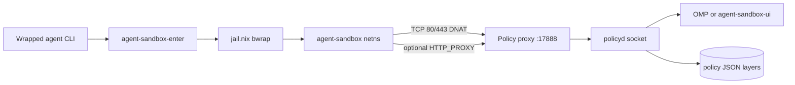

# agent-sandbox

NixOS module that wraps LLM agent CLIs in a filesystem jail ([jail.nix](https://alexdav.id/projects/jail-nix/)) and optionally enforces deny-by-default outbound network access with interactive approvals through OMP or `agent-sandbox-ui`.

## Layout

```
agent-sandbox/
├── default.nix          # module options, jail wrapping, launcher install
├── lib.nix              # jail-nix helpers (mount paths, symlinks)
├── combinators.nix      # jail-nix combinators (netns, proxy env, mounts)
├── network.nix          # netns, DNS proxy, policy proxy, policyd service
├── sudo-guard.nix       # sudo shim → policyd elevation flow
├── netns/               # network namespace setup (shell + enter helper)
│   ├── enter.nix / enter.c
│   ├── up.sh / down.sh
│   └── host-nat.sh
└── policy/              # Python runtime (built by policy/package.nix)
    ├── package.nix
    ├── daemon/          # policyd, merge, session state
    ├── proxy/           # TCP proxy, host/SNI matching, /proc context
    ├── dns/             # DNS proxy + wire format + answer cache
    ├── cli/             # approve / elevate client tools
    └── tests/
```

Installed binaries: `agent-sandbox-policyd`, `agent-sandbox-proxy`, `agent-sandbox-dns-proxy`, `agent-sandbox-approve`, `agent-sandbox-elevate`, `agent-sandbox-ui`, `agent-sandbox-enter`.

## What it does

**Filesystem.** Each wrapped command (`omp`, `codex`, …) is replaced by a launcher that runs the real binary as `unsafe-<name>` inside bubblewrap. Read-only and read-write mount lists come from Nix options (`readonlyDirs`, `readwriteDirs`). Symlinks under the home tree (e.g. chezmoi → dotfiles) are resolved to read-only binds at their real paths.

**Network (optional).** When `agent-sandbox.network.enable = true`, the launcher joins a dedicated network namespace before bwrap. nftables drops egress by default and DNATs TCP 80/443 to a policy proxy. Unknown destinations block until a registered UI client (OMP extension or `agent-sandbox-ui`) approves or denies (same as elevation).

**Elevation (optional).** With `sudoPolicy = "approve"` (default), a `sudo` shim on the jail `PATH` forwards commands to policyd for OMP approval, then runs them as root on the host. Set `"deny"` to block elevation entirely.

## How it works



### Wrapping flow

1. Nix installs the jailed launcher as the original command name via `jail-nix.lib.extend` and agent-specific combinators in `combinators.nix`.
2. If network is enabled, `agent-sandbox-enter` (capabilities `CAP_SYS_ADMIN`, `CAP_NET_ADMIN`) moves the process into the `agent-sandbox` netns, then jail.nix runs bwrap with `share-ns "net"`.
3. Combinators inject proxy environment variables, restricted resolv/nsswitch configs, and launch context env vars (`AGENT_SANDBOX_PROJECT_ROOT`, policy socket path).

`inherit-shell-env` forwards the invoking shell’s environment and ro-binds absolute paths it finds (for devShell/direnv tools outside `$HOME`). Paths under `$HOME` are **not** auto-mounted — only `readonlyDirs` / `readwriteDirs` / `readonlyFiles` / `readwriteFiles` entries for `~/…` (plus `$PWD` rw). Env vars like `XDG_CONFIG_HOME` may still be set even when that directory is not mounted.

The jail shares the host **pid** namespace so the proxy can read client context from `/proc/<pid>/environ` and `SO_PEERCRED`.

### Policy layers

Merged lowest → highest precedence:

| Layer       | Source                                                                |
| ----------- | --------------------------------------------------------------------- |
| Declarative | `/etc/agent-sandbox/declarative.json` from `network.declarativeAllow` |
| Global user | `~/.config/agent-sandbox/policy.json`                                 |
| Project     | `<repo>/.agent-sandbox/policy.json`                                   |

Project **deny** rules beat in-memory once/session grants. Session and once approvals are not persisted. policyd writes `/var/lib/agent-sandbox/exported-policy.json` as a merged snapshot for inspection only — it is not loaded back into the merge stack.

Project root is fixed at sandbox launch (`AGENT_SANDBOX_PROJECT_ROOT` = git toplevel of cwd, or cwd if not in a repo).

### Network stack

| Component                 | Role                                                                                                                 |
| ------------------------- | -------------------------------------------------------------------------------------------------------------------- |
| `netns/up.sh`             | Creates veth pair, assigns addresses, applies nftables rules                                                         |
| `netns/host-nat.sh`       | Host-side `route_localnet` / DNS acceptance on the veth                                                              |
| `agent-sandbox-dns-proxy` | Listens on the veth gateway; forwards to `dnsForwardTarget`; caches A/AAAA in `/run/agent-sandbox/dns-cache.json`    |
| `agent-sandbox-proxy`     | Policy gate on `127.0.0.1:17888`; uses DNS cache, SNI, or PTR to identify transparent redirects; tunnels allowed TCP |
| nftables                  | Default drop; DNAT 80/443 → proxy (non-root UIDs); allow DNS, loopback, established                                  |

Sandboxes resolve via `nameserver 169.254.100.1` (`/etc/agent-sandbox/resolv.conf`) with plain DNS (`hosts: files dns`). Transparent redirect (`transparentRedirect`, default `true`) catches apps that ignore `HTTP_PROXY`; `injectProxyEnv` (default `true`) sets proxy env for clients that use it.

### Approvals

**Network:** blocking deny until approved when `interactiveApproval` is enabled. Scopes: `once` (this connection only), `session`, `project`, `global`. CLI `approve-host` still uses `once_allow` for pre-approving before a request. OMP blocking **Allow once** does not stash a spare grant for the next connection.

**Elevation:** blocking pending request; OMP or `agent-sandbox-approve` with pending id.

OMP extension lives at `~/.omp/private_agent/extensions/agent-sandbox` — enable in `config.yml` with `extensions: ['./extensions/agent-sandbox']`. On connect it registers UI session context (cwd, home, project root) to `/run/agent-sandbox/session-context.json`.

### Other agents (OpenCode, codex, droid, …)

No per-agent OpenCode plugin: the background server often has no `/dev/tty`, so a plugin cannot reliably register as policy UI. Use the same paths as any non-OMP agent:

- **`policy.autoSpawnPolicyUi`** (default **true**) — policyd runs `agent-sandbox-ui` as the sandbox user when no UI is connected (`/dev/tty` or **kdialog** / Qt).
- **OMP extension** — if you use OMP for that session instead.
- **Manual:** `agent-sandbox-ui` in a terminal.
- **CLI:** `agent-sandbox-approve approve-host …`
- **OpenCode slash command:** `~/.config/opencode/commands/agent-sandbox-network.md` (documentation only).

Wrap `opencode` via `agent-sandbox.packages` in NixOS like other agents. OpenCode `permission` rules in `opencode.json` only gate tools (bash, read, edit), not the TCP proxy.

### Sudo shim

| `sudoPolicy`        | Behaviour                                         |
| ------------------- | ------------------------------------------------- |
| `approve` (default) | Shim → policyd → OMP prompt → host root execution |
| `deny`              | Always rejected                                   |

v1 supports `sudo <command> [args…]` only. Agents can still invoke a store-path `sudo` if it is on their closure — treat as UX guard, not a kernel guarantee.

## Enable

```nix
{
  agent-sandbox.network.enable = true;
  # agent-sandbox.sudoPolicy = "deny";
}
```

Starts `agent-sandbox-policy` and, when network is enabled, `agent-sandbox-netns`, `agent-sandbox-dns`, and `agent-sandbox-proxy`.

Optional export of merged allows to a local Nix fragment:

```nix
agent-sandbox.policy.exportedNix = "/path/to/auto-approvals.nix";
```
