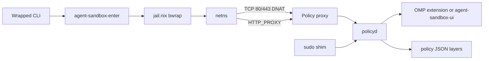

# agent-sandbox

NixOS module: jail-wrapped agent CLIs ([jail.nix](https://alexdav.id/projects/jail-nix/)), optional deny-by-default egress with interactive approvals, and optional `sudo` elevation gated by the same policy daemon.

## Quick start

```nix
{
  agent-sandbox.network.enable = true;
  # agent-sandbox.sudoPolicy = "deny";
}
```

Wrap agents in `agent-sandbox.packages` (e.g. `omp`, `opencode`). With network enabled, systemd runs `agent-sandbox-policy`, `agent-sandbox-netns`, `agent-sandbox-dns`, and `agent-sandbox-proxy`.

## Architecture



**Binaries:** `agent-sandbox-policyd`, `agent-sandbox-proxy`, `agent-sandbox-dns-proxy`, `agent-sandbox-approve`, `agent-sandbox-elevate`, `agent-sandbox-ui`, `agent-sandbox-enter`.

## Filesystem jail

Launchers run the real binary as `unsafe-<name>` inside bubblewrap. Mounts come from `readonlyDirs` / `readwriteDirs` (and per-package overrides). Symlinks under `$HOME` (e.g. chezmoi → dotfiles) resolve to read-only binds at their targets.

`inherit-shell-env` forwards the invoking shell’s environment and ro-binds absolute paths it finds; paths under `$HOME` are not auto-mounted unless listed in mount options. The jail shares the host **pid** namespace so the proxy can read `AGENT_SANDBOX_*` from `/proc/<pid>/environ`.

## Network

When `agent-sandbox.network.enable = true`, `agent-sandbox-enter` joins the `agent-sandbox` netns before bwrap. nftables drops egress by default and DNATs TCP 80/443 to the policy proxy on loopback inside the netns.

| Piece                        | Role                                                                   |
| ---------------------------- | ---------------------------------------------------------------------- |
| `netns/up.sh`, `host-nat.sh` | veth, addresses, host `route_localnet` / DNS path                      |
| `agent-sandbox-dns-proxy`    | Gateway DNS; cache at `/run/agent-sandbox/dns-cache.json`              |
| `agent-sandbox-proxy`        | Gate on `127.0.0.1:17888`; SNI / cache / PTR for transparent redirects |

Sandboxes use `nameserver 169.254.100.1` (`/etc/agent-sandbox/resolv.conf`). `transparentRedirect` (default true) catches apps that ignore proxy env; `injectProxyEnv` (default true) sets `HTTP_PROXY` for clients that honor it.

Unknown hosts block until a UI client allows or denies (when `policy.interactiveApproval` is true). Allow/deny scopes: `once`, `session`, `project`, `global` (written to `network.allow` / `network.deny`). Project **deny** beats in-memory grants. `agent-sandbox-approve approve-host` can pre-allow before a request.

Sudo uses the same scopes; approvals persist to `sudo.allow` / `sudo.deny`. Policy `sudo.allow` runs without a prompt; `sudo.deny` rejects immediately.

## Policy layers

```json
{
    "network": {
        "allow": [{ "host": "example.com", "port": 443 }],
        "deny": []
    },
    "sudo": {
        "allow": [{ "argv": ["systemctl", "restart"] }],
        "deny": [{ "argv": ["rm"] }]
    }
}
```

Sudo `argv` uses prefix matching (`["systemctl"]` matches `systemctl restart nginx`).

Merged lowest → highest:

| Layer       | Source                                                                         |
| ----------- | ------------------------------------------------------------------------------ |
| Declarative | `/etc/agent-sandbox/declarative.json` (`declarativeAllow` / `declarativeDeny`) |
| Global      | `~/.config/agent-sandbox/policy.json`                                          |
| Project     | `<repo>/.agent-sandbox/policy.json`                                            |

`AGENT_SANDBOX_PROJECT_ROOT` is set at launch (git toplevel of cwd, or cwd). policyd writes `/var/lib/agent-sandbox/exported-policy.json` for inspection only; it is not loaded back into the merge stack.

## Approvals UI

One long-lived client registers with policyd (`register_ui`) and handles `network_request` and `elevation_request` messages.

| Path                                          | When to use                                                                                |
| --------------------------------------------- | ------------------------------------------------------------------------------------------ |
| **OMP extension**                             | `~/.omp/agent/extensions/agent-sandbox` in `config.yml` — exclusive prompts when connected |
| **`agent-sandbox-ui`**                        | OpenCode, codex, droid, etc. — kdialog on Plasma/Wayland, `/dev/tty` fallback              |
| **`policy.autoSpawnPolicyUi`** (default true) | Spawns `agent-sandbox-ui` only when no UI is connected and OMP is not registered           |
| **`agent-sandbox-approve`**                   | Scripting; `approve-host`, `pending`, approve/deny by id                                   |

Spawn log: `/run/user/<uid>/agent-sandbox-ui.log`. Service log: `journalctl -u agent-sandbox-policy`.

kdialog menus are sized for eight options (`--geometry`, default `580x382`). Override with `AGENT_SANDBOX_KDIALOG_GEOMETRY=640x480` on the UI process if you want taller/wider.

## Sudo

| `sudoPolicy`        | Behaviour                                                                       |
| ------------------- | ------------------------------------------------------------------------------- |
| `approve` (default) | Jail `sudo` shim → `agent-sandbox-elevate` → policyd → UI → host root execution |
| `deny`              | Rejected                                                                        |

v1: `sudo <command> [args…]` only (no `-u` / `-E`). Agents may still run a store-path `sudo` from their closure — treat as UX guard, not a kernel guarantee.

## Layout

```
agent-sandbox/
├── default.nix, lib.nix, combinators.nix
├── network.nix, sudo-guard.nix
├── netns/                 # up/down, host-nat, enter helper
└── policy/
    ├── package.nix
    ├── graphical_env.py   # Plasma/Wayland env for spawned kdialog
    ├── daemon/            # policyd, merge, session context
    ├── proxy/, dns/
    ├── cli/               # approve, elevate, ui_client
    └── tests/
```

## Options

| Option                       | Notes                                                             |
| ---------------------------- | ----------------------------------------------------------------- |
| `policy.interactiveApproval` | Block unknown hosts until UI responds (default true)              |
| `policy.approvalTimeout`     | Seconds to wait after UI is connected (default 300)               |
| `policy.autoSpawnPolicyUi`   | Spawn `agent-sandbox-ui` when no client registered (default true) |
| `policy.exportedNix`         | Optional path to emit merged allows as a `.nix` fragment          |

```nix
agent-sandbox.policy.exportedNix = "/path/to/auto-approvals.nix";
```
